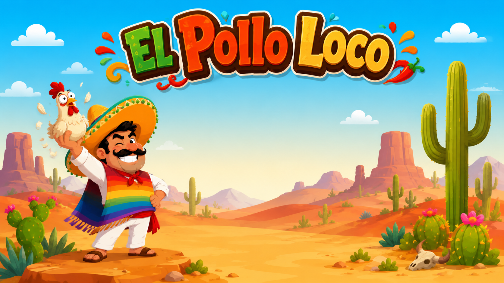

# El Pollo Loco



El Pollo Loco ist ein browserbasiertes 2D-Jump’n’Run, das mit objektorientiertem Vanilla JavaScript und dem HTML5 Canvas umgesetzt wurde. Begleite Pepe durch die Wüste, sammle Münzen und Salsa-Flaschen, besiege Hühner und stelle dich am Ende dem Endboss.

## Live-Demo

Das Spiel kann direkt im Browser gestartet werden:

- [El Pollo Loco spielen](https://el-pollo-loco.revan-celik.de)

## Features

- Animiertes 2D-Gameplay im HTML5 Canvas
- Objektorientierte Spiellogik mit JavaScript-Klassen
- Gegner, Endboss und Kollisionssystem
- Sammelbare Münzen und Salsa-Flaschen
- Wurfmechanik zum Bekämpfen der Gegner
- Lebens-, Münz-, Flaschen- und Endboss-Anzeigen
- Musik und Soundeffekte mit getrennten Ein-/Aus-Schaltern
- Fullscreen-Modus inklusive Fallback für mobile Browser
- Responsive Touch-Steuerung für Smartphones und Tablets
- Zufällige Positionierung von Gegnern und Sammelobjekten
- Neustart und Rückkehr zum Hauptmenü ohne Neuladen der Seite

## Steuerung

| Aktion | Tastatur | Mobilgerät |
| --- | --- | --- |
| Nach links laufen | `←` | Linke Pfeiltaste |
| Nach rechts laufen | `→` | Rechte Pfeiltaste |
| Springen | `↑` oder `Leertaste` | Sprungtaste |
| Flasche werfen | `D` | Flaschentaste |

Auf Mobilgeräten wird das Spiel im Querformat gespielt.

## Technologien

- HTML
- CSS
- JavaScript

## Projekt lokal starten

Da das Spiel ausschließlich im Browser läuft, ist kein Build-Prozess erforderlich.

1. Repository klonen:

   ```bash
   git clone https://github.com/RevanCelik/el_pollo_loco.git
   ```

2. In das Projektverzeichnis wechseln:

   ```bash
   cd el_pollo_loco
   ```

3. Einen lokalen Webserver starten, zum Beispiel mit Python:

   ```bash
   python -m http.server 8000
   ```

4. Im Browser [http://localhost:8000](http://localhost:8000) öffnen.

Alternativ kann das Projekt mit einer lokalen Server-Erweiterung wie Live Server gestartet werden.

## Projektstruktur

```text
el_pollo_loco/
├── audio/          # Musik und Soundeffekte
├── docs/           # Generierte JSDoc-Dokumentation
├── fonts/          # Lokale Schriftarten
├── img/            # Grafiken und Animations-Frames
├── js/             # Spielstart, Steuerung und UI-Funktionen
├── levels/         # Aufbau und Inhalte der Level
├── models/         # Klassen für Spielfiguren, Welt und Objekte
├── index.html      # Einstiegspunkt des Spiels
└── style.css       # Einstiegspunkt der Stylesheets
```

## Spielprinzip

Pepe bewegt sich durch eine scrollende Wüstenlandschaft. Gegner können durch einen Sprung auf den Kopf oder mit gesammelten Salsa-Flaschen besiegt werden. Münzen und Flaschen erscheinen bei jedem neuen Spiel an wechselnden Positionen. Das Ziel ist es, den Endboss zu erreichen und mit gezielten Flaschenwürfen zu besiegen, ohne Pepes Lebensenergie zu verlieren.

## Dokumentation

Die generierte JSDoc-Dokumentation befindet sich unter [`docs/index.html`](docs/index.html). Nach dem Start eines lokalen Webservers kann sie über [http://localhost:8000/docs/](http://localhost:8000/docs/) geöffnet werden.

## Autor

Entwickelt von [Revan Celik](https://github.com/RevanCelik).
